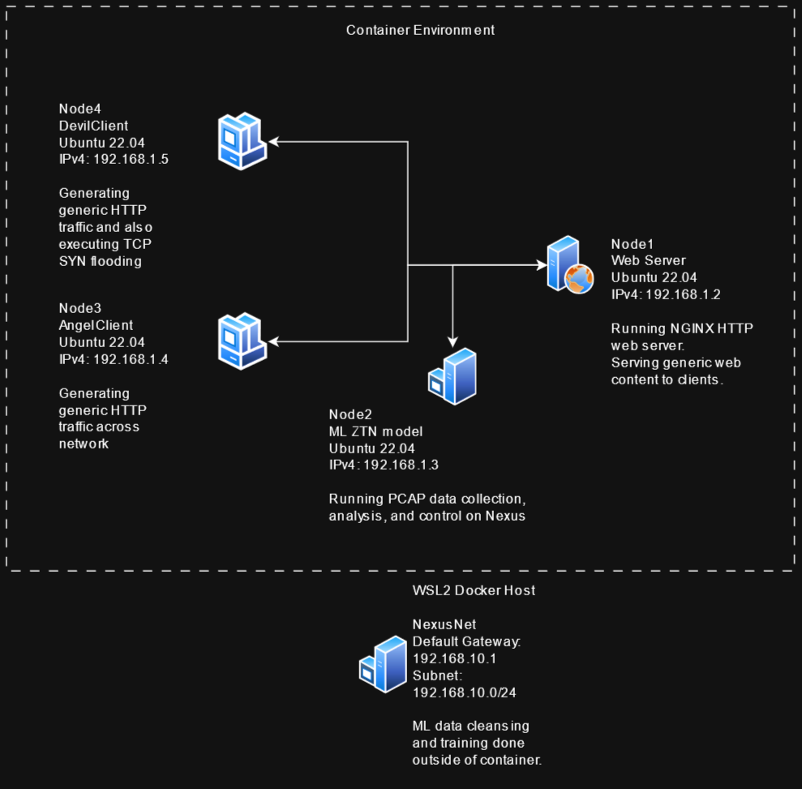

# ZtnDataCleansing
This repo contains dockerfiles and docker compose files for a research project for the CYB 330 (Networking and Control Systems) course at the University of Idaho.
It explores the effect that data cleansing has on the decision making of a zero touch networking ML model when training on cleansed and uncleased data.

***
## Usage
In order to start the docker network, simply run `docker compose up`
Ctrl+C can be used to stop the containers; alternatively `docker compose stop` will accomplish the same goal.

`docker container <container name> exec <command>(ie. bash)` will allow you to execute commands on a certain container; useful for opening up interactive shells.

***
## Topology explanation
Node4 DevilClient and Node3 AngelClient are basic Ubuntu images.
They will have python scripts for the generation of http, icmp, and tcp traffic to connect to the Node1 web server.
DevilClient will also be loaded with scripts to execute synflooding attacks.
These will be executed at dispersed intervals in order to mix in good traffic with bad traffic.

Node2, the ML model, will be conducting packet captures on the network traffic between the web server and the clients.
This data will then be exported from the container in order to train the model outside of the docker environment.
After training, the new model will be containerized in order to capture and analyze live traffic to make predictions of whether a host is malicious or nonmalicious.
As a result, the end product for this project should have an ML model trained on good cleaned data, and one model trained on bad data.
Hopefully we will see better performance on predicting malicious behavior from web clients with the one trained on good data.
This decision will be the "network management" portion of the ZTN, although no action will be taken (as of now).
Normally, the next step of the implementation would be to have the network block traffic from the DevilClient.
